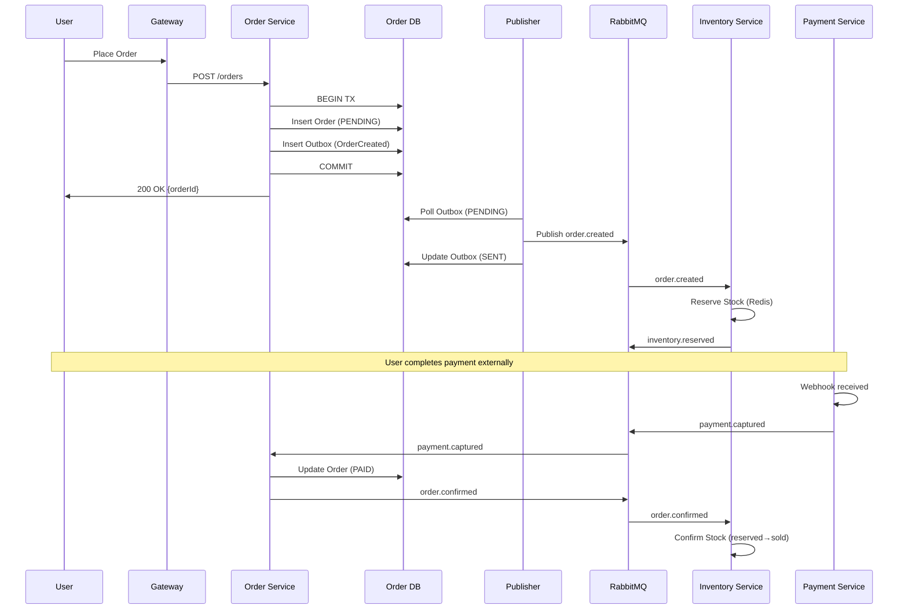
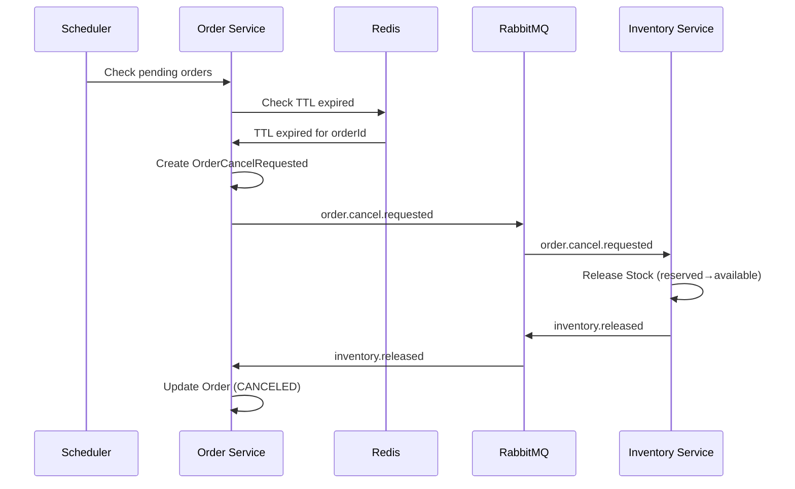

# Message Queue Architecture Design

## Core Principles

1. **Transactional Outbox Pattern**: Ensure atomicity between business operations and event publishing
2. **Consumer Idempotency**: Prevent duplicate processing via dedupe table
3. **Event-Driven Architecture**: Services communicate via domain events, not direct calls
4. **Eventual Consistency**: Accept temporary inconsistency for better scalability

## Implementation Options

This document covers two implementation paths:
1. **AWS Native (Recommended)**: SNS + SQS + Lambda for cloud-native deployment
2. **RabbitMQ**: Traditional message broker for on-premise or multi-cloud

## Outbox Pattern Implementation

### 1. Outbox Table Structure

```sql
CREATE TABLE outbox_events (
    id BIGSERIAL PRIMARY KEY,
    aggregate_id VARCHAR(64) NOT NULL,     -- Business entity ID (orderId, itemId, etc.)
    event_type VARCHAR(50) NOT NULL,       -- order.created, payment.captured, etc.
    payload JSONB NOT NULL,                -- Event data
    status VARCHAR(20) DEFAULT 'PENDING',  -- PENDING, SENT, FAILED
    created_at TIMESTAMP DEFAULT NOW(),
    sent_at TIMESTAMP,
    retry_count INT DEFAULT 0,
    error_message TEXT,
    INDEX idx_outbox_status (status),
    INDEX idx_outbox_created (created_at)
);
```

### 2. Publisher Implementation

```java
@Component
public class OutboxPublisher {

    @Scheduled(fixedDelay = 5000)
    @Transactional
    public void publishPendingEvents() {
        List<OutboxEvent> events = outboxRepository
            .findTop100ByStatusOrderByCreatedAt("PENDING");

        for (OutboxEvent event : events) {
            try {
                Message message = MessageBuilder
                    .withBody(event.getPayload())
                    .setMessageId(event.getId().toString())
                    .setHeader("aggregate_id", event.getAggregateId())
                    .setHeader("event_type", event.getEventType())
                    .build();

                rabbitTemplate.send("lmall.events",
                    event.getEventType(), message);

                event.setStatus("SENT");
                event.setSentAt(LocalDateTime.now());
            } catch (Exception e) {
                event.incrementRetryCount();
                if (event.getRetryCount() > MAX_RETRIES) {
                    event.setStatus("FAILED");
                    event.setErrorMessage(e.getMessage());
                }
            }
            outboxRepository.save(event);
        }
    }
}
```

## Consumer Idempotency

### 1. Dedupe Table Structure

```sql
CREATE TABLE consumer_dedupe (
    consumer_name VARCHAR(100) NOT NULL,
    message_id VARCHAR(64) NOT NULL,
    processed_at TIMESTAMP DEFAULT NOW(),
    PRIMARY KEY (consumer_name, message_id),
    INDEX idx_processed_at (processed_at)
);

-- Cleanup job: Delete entries older than 7 days
DELETE FROM consumer_dedupe
WHERE processed_at < NOW() - INTERVAL '7 days';
```

### 2. Idempotent Consumer Implementation

```java
@Component
public abstract class IdempotentMessageHandler {

    @Autowired
    private ConsumerDedupeRepository dedupeRepo;

    @RabbitListener(queues = "${queue.name}")
    @Transactional
    public void handleMessage(Message message) {
        String messageId = message.getMessageProperties().getMessageId();
        String consumerName = this.getClass().getSimpleName();

        // Check idempotency
        if (dedupeRepo.existsByConsumerNameAndMessageId(consumerName, messageId)) {
            log.info("Duplicate message ignored: {}", messageId);
            return;
        }

        try {
            // Process message
            processMessage(message);

            // Mark as processed
            dedupeRepo.save(new ConsumerDedupe(consumerName, messageId));
        } catch (Exception e) {
            // Let RabbitMQ retry mechanism handle it
            throw new AmqpRejectAndDontRequeueException("Processing failed", e);
        }
    }

    protected abstract void processMessage(Message message);
}
```

## AWS SNS/SQS Configuration (Recommended)

### 1. SNS Topics Setup

```yaml
Topics:
  OrderEvents:
    Type: AWS::SNS::Topic
    Properties:
      TopicName: lmall-order-events.fifo
      FifoTopic: true
      ContentBasedDeduplication: true
      MessageRetentionPeriod: 1209600  # 14 days

  PaymentEvents:
    Type: AWS::SNS::Topic
    Properties:
      TopicName: lmall-payment-events.fifo
      FifoTopic: true
      ContentBasedDeduplication: true

  InventoryEvents:
    Type: AWS::SNS::Topic
    Properties:
      TopicName: lmall-inventory-events
      FifoTopic: false  # Standard topic for non-critical events
```

### 2. SQS Queue Configuration

```java
@Configuration
public class SQSConfig {

    @Bean
    public AmazonSQS amazonSQS() {
        return AmazonSQSClientBuilder.standard()
            .withRegion(Regions.US_EAST_1)
            .build();
    }

    @PostConstruct
    public void createQueues() {
        // Create FIFO queue for critical order events
        CreateQueueRequest orderQueue = new CreateQueueRequest()
            .withQueueName("order-payment-captured.fifo")
            .addAttributesEntry("FifoQueue", "true")
            .addAttributesEntry("MessageRetentionPeriod", "345600")  // 4 days
            .addAttributesEntry("VisibilityTimeout", "30")
            .addAttributesEntry("RedrivePolicy",
                "{\"deadLetterTargetArn\":\"arn:aws:sqs:us-east-1:account:order-payment-captured-dlq.fifo\",\"maxReceiveCount\":5}");

        amazonSQS.createQueue(orderQueue);
    }
}
```

### 3. SNS Publisher Implementation

```java
@Component
public class SNSOutboxPublisher {

    private final AmazonSNS snsClient;
    private final OutboxRepository outboxRepository;

    @Scheduled(fixedDelay = 5000)
    @Transactional
    public void publishPendingEvents() {
        List<OutboxEvent> pendingEvents = outboxRepository
            .findTop100ByStatusOrderByCreatedAt("PENDING");

        for (OutboxEvent event : pendingEvents) {
            try {
                String topicArn = getTopicArn(event.getEventType());

                PublishRequest request = new PublishRequest()
                    .withTopicArn(topicArn)
                    .withMessage(event.getPayload())
                    .withMessageGroupId(event.getAggregateId())  // For FIFO topics
                    .withMessageDeduplicationId(event.getId().toString())
                    .withMessageAttributes(Map.of(
                        "event_type", new MessageAttributeValue()
                            .withDataType("String")
                            .withStringValue(event.getEventType()),
                        "aggregate_id", new MessageAttributeValue()
                            .withDataType("String")
                            .withStringValue(event.getAggregateId())
                    ));

                PublishResult result = snsClient.publish(request);

                event.setStatus("SENT");
                event.setSentAt(LocalDateTime.now());
                event.setMessageId(result.getMessageId());

                log.debug("Published event {} to SNS: {}",
                    event.getId(), result.getMessageId());

            } catch (AmazonSNSException e) {
                handlePublishError(event, e);
            }

            outboxRepository.save(event);
        }
    }
}
```

### 4. SQS Consumer with Spring Cloud AWS

```java
@Component
@Slf4j
public class SQSEventConsumer {

    private final ConsumerDedupeRepository dedupeRepository;

    @SqsListener(value = "order-payment-captured.fifo", deletionPolicy = SqsMessageDeletionPolicy.ON_SUCCESS)
    @Transactional
    public void handlePaymentCaptured(@Payload String messageBody,
                                     @Headers Map<String, String> headers,
                                     Acknowledgment acknowledgment) {

        String messageId = headers.get("MessageId");
        String consumerName = "OrderPaymentHandler";

        // Check idempotency
        if (dedupeRepository.existsByConsumerNameAndMessageId(consumerName, messageId)) {
            log.info("Duplicate message ignored: {}", messageId);
            acknowledgment.acknowledge();
            return;
        }

        try {
            // Parse and process message
            PaymentCapturedEvent event = objectMapper.readValue(messageBody, PaymentCapturedEvent.class);
            processPaymentCaptured(event);

            // Mark as processed
            dedupeRepository.save(new ConsumerDedupe(consumerName, messageId));
            acknowledgment.acknowledge();

            log.info("Processed payment captured for order: {}", event.getOrderId());

        } catch (Exception e) {
            log.error("Failed to process message {}", messageId, e);
            throw new RuntimeException(e);  // Let SQS retry
        }
    }
}
```

### 5. Spring Cloud AWS Configuration

```yaml
cloud:
  aws:
    region:
      static: us-east-1
    credentials:
      instance-profile: true  # Use EC2 instance role

    sqs:
      listener:
        auto-startup: true
        max-number-of-messages: 10
        wait-time-seconds: 20  # Long polling
        visibility-timeout: 30
        acknowledge-mode: MANUAL

spring:
  cloud:
    aws:
      messaging:
        listener:
          sqs:
            max-concurrent-messages: 10
            max-messages-per-poll: 10
```

### 6. DLQ Processing with Lambda

See [LAMBDA-FUNCTIONS.md](./LAMBDA-FUNCTIONS.md) for detailed Lambda implementations for DLQ replay.

### 7. CloudWatch Monitoring

```java
@Component
public class SQSMetrics {

    private final CloudWatchClient cloudWatchClient;

    @Scheduled(fixedDelay = 60000)
    public void reportQueueMetrics() {
        GetQueueAttributesRequest request = GetQueueAttributesRequest.builder()
            .queueUrl(queueUrl)
            .attributeNames(QueueAttributeName.APPROXIMATE_NUMBER_OF_MESSAGES,
                          QueueAttributeName.APPROXIMATE_NUMBER_OF_MESSAGES_NOT_VISIBLE)
            .build();

        GetQueueAttributesResponse response = sqsClient.getQueueAttributes(request);

        PutMetricDataRequest metricRequest = PutMetricDataRequest.builder()
            .namespace("LMall/SQS")
            .metricData(
                MetricDatum.builder()
                    .metricName("QueueDepth")
                    .value(Double.valueOf(response.attributes().get(QueueAttributeName.APPROXIMATE_NUMBER_OF_MESSAGES)))
                    .timestamp(Instant.now())
                    .build()
            )
            .build();

        cloudWatchClient.putMetricData(metricRequest);
    }
}
```

## RabbitMQ Configuration (Alternative)

### 1. Exchange and Queue Topology

```yaml
# Exchange Definition
exchanges:
  - name: lmall.events
    type: topic
    durable: true

# Queue Bindings
queues:
  # Order Service Queues
  - name: order.payment.captured
    exchange: lmall.events
    routing-key: payment.captured
    dlq: order.payment.captured.dlq

  - name: order.inventory.released
    exchange: lmall.events
    routing-key: inventory.released
    dlq: order.inventory.released.dlq

  # Inventory Service Queues
  - name: inventory.order.created
    exchange: lmall.events
    routing-key: order.created
    dlq: inventory.order.created.dlq

  - name: inventory.order.cancel.requested
    exchange: lmall.events
    routing-key: order.cancel.requested
    dlq: inventory.order.cancel.requested.dlq

  - name: inventory.order.confirmed
    exchange: lmall.events
    routing-key: order.confirmed
    dlq: inventory.order.confirmed.dlq

  # Payment Service Queues
  - name: payment.order.created
    exchange: lmall.events
    routing-key: order.created
    dlq: payment.order.created.dlq
```

### 2. DLQ Configuration

```java
@Configuration
public class RabbitConfig {

    @Bean
    public Queue businessQueue() {
        return QueueBuilder.durable("inventory.order.created")
            .withArgument("x-dead-letter-exchange", "")
            .withArgument("x-dead-letter-routing-key", "inventory.order.created.dlq")
            .withArgument("x-message-ttl", 600000) // 10 minutes
            .build();
    }

    @Bean
    public Queue dlq() {
        return QueueBuilder.durable("inventory.order.created.dlq")
            .withArgument("x-message-ttl", 604800000) // 7 days
            .build();
    }
}
```

### 3. Retry Policy

```yaml
spring:
  rabbitmq:
    listener:
      simple:
        retry:
          enabled: true
          initial-interval: 1000    # 1s
          multiplier: 2.0           # Exponential backoff
          max-interval: 600000      # 10 minutes max
          max-attempts: 6           # 1s, 2s, 4s, 8s, 16s, 32s
        default-requeue-rejected: false  # Send to DLQ after max attempts
```

## Message Schema

### Standard Event Structure

```json
{
  "event_type": "order.created",
  "event_id": "123456",                    // outbox.id
  "occurred_at": "2024-01-14T10:30:00Z",
  "aggregate_id": "ORDER-2024-001",        // Business entity ID
  "schema_version": "1.0",
  "correlation_id": "req-uuid-123",        // For tracing
  "payload": {
    "order_id": "ORDER-2024-001",
    "user_id": "USER123",
    "items": [
      {
        "sku": "ITEM001",
        "quantity": 2,
        "price": 99.99
      }
    ],
    "total_amount": 199.98,
    "created_at": "2024-01-14T10:30:00Z"
  }
}
```

### Event Types

| Event Type | Producer | Consumers | Description |
|------------|----------|-----------|-------------|
| order.created | order-service | inventory, payment | New order placed |
| order.cancel.requested | order-service | inventory | Cancel order request |
| order.confirmed | order-service | inventory, notification | Order confirmed after payment |
| order.canceled | order-service | notification | Order canceled |
| payment.captured | payment-service | order | Payment successful |
| payment.failed | payment-service | order | Payment failed |
| inventory.reserved | inventory-service | order | Stock reserved |
| inventory.released | inventory-service | order | Stock released |
| inventory.sold | inventory-service | analytics | Stock sold |

## Order Processing Flows

### 1. Successful Order Flow



### 2. Timeout Cancellation Flow



## Payment Webhook Handling

### 1. Webhook Security

```java
@RestController
@RequestMapping("/webhooks")
public class PaymentWebhookController {

    @PostMapping("/payment/{provider}")
    @Transactional
    public ResponseEntity<Void> handleWebhook(
            @PathVariable String provider,
            @RequestHeader("X-Signature") String signature,
            @RequestHeader("X-Timestamp") String timestamp,
            @RequestBody String payload) {

        // 1. Validate timestamp (5-minute window)
        if (!isTimestampValid(timestamp, 5 * 60)) {
            return ResponseEntity.status(401).build();
        }

        // 2. Validate HMAC signature
        String expectedSignature = generateHMAC(payload, timestamp, SECRET_KEY);
        if (!signature.equals(expectedSignature)) {
            return ResponseEntity.status(401).build();
        }

        // 3. Parse event
        PaymentEvent event = parseEvent(payload);

        // 4. Idempotency check
        if (paymentEventRepo.existsByEventId(event.getEventId())) {
            return ResponseEntity.ok().build(); // Already processed
        }

        // 5. Process and publish
        Payment payment = processPayment(event);
        outboxRepo.save(new OutboxEvent(
            payment.getOrderId(),
            "payment.captured",
            payment.toJson()
        ));

        return ResponseEntity.ok().build();
    }
}
```

### 2. HMAC Implementation

```java
public class WebhookSecurity {

    public static String generateHMAC(String data, String timestamp, String key) {
        String message = timestamp + "." + data;
        Mac mac = Mac.getInstance("HmacSHA256");
        SecretKeySpec secretKey = new SecretKeySpec(key.getBytes(), "HmacSHA256");
        mac.init(secretKey);
        byte[] hash = mac.doFinal(message.getBytes());
        return Base64.getEncoder().encodeToString(hash);
    }

    public static boolean isTimestampValid(String timestamp, int windowSeconds) {
        long webhookTime = Long.parseLong(timestamp);
        long currentTime = System.currentTimeMillis() / 1000;
        return Math.abs(currentTime - webhookTime) <= windowSeconds;
    }
}
```

## Order Timeout Handling

### 1. Redis TTL Implementation

```java
@Service
public class OrderTimeoutService {

    @Value("${order.payment.timeout:900}") // 15 minutes
    private int paymentTimeoutSeconds;

    public void createPaymentTimeout(String orderId) {
        String key = "payment:timeout:" + orderId;
        redisTemplate.opsForValue().set(key, orderId,
            paymentTimeoutSeconds, TimeUnit.SECONDS);
    }

    @Scheduled(fixedDelay = 60000) // Check every minute
    public void processTimeouts() {
        List<Order> pendingOrders = orderRepo
            .findByStatusAndCreatedBefore(
                OrderStatus.PENDING,
                LocalDateTime.now().minusSeconds(paymentTimeoutSeconds)
            );

        for (Order order : pendingOrders) {
            // Create cancellation event
            outboxRepo.save(new OutboxEvent(
                order.getId(),
                "order.cancel.requested",
                CancelRequest.of(order).toJson()
            ));

            log.info("Order {} timeout, cancellation requested", order.getId());
        }
    }
}
```

## DLQ Reprocessing

### 1. Manual Replay Tool

```java
@Component
public class DLQReplayer {

    @Autowired
    private RabbitTemplate rabbitTemplate;

    public void replayDLQMessages(String dlqName, int limit) {
        for (int i = 0; i < limit; i++) {
            Message message = rabbitTemplate.receive(dlqName, 1000);
            if (message == null) break;

            try {
                // Extract original queue from DLQ name
                String originalQueue = dlqName.replace(".dlq", "");

                // Add replay headers
                MessageProperties props = message.getMessageProperties();
                props.setHeader("x-replay", true);
                props.setHeader("x-replay-time", System.currentTimeMillis());

                // Send back to original queue
                rabbitTemplate.send("", originalQueue, message);

                log.info("Replayed message {} from DLQ",
                    props.getMessageId());

            } catch (Exception e) {
                // Put back in DLQ
                rabbitTemplate.send("", dlqName, message);
                log.error("Failed to replay message", e);
                break;
            }
        }
    }
}
```

### 2. Automated DLQ Monitor

```java
@Component
public class DLQMonitor {

    @Scheduled(fixedDelay = 300000) // Every 5 minutes
    public void checkDLQs() {
        List<String> dlqNames = Arrays.asList(
            "order.payment.captured.dlq",
            "inventory.order.created.dlq",
            // ... other DLQs
        );

        for (String dlq : dlqNames) {
            Long messageCount = rabbitAdmin.getQueueInfo(dlq).getMessageCount();

            if (messageCount > 0) {
                // Send alert
                alertService.sendAlert(AlertLevel.WARNING,
                    String.format("DLQ %s has %d messages", dlq, messageCount));

                // Auto-replay if configured
                if (shouldAutoReplay(dlq)) {
                    dlqReplayer.replayDLQMessages(dlq, 10);
                }
            }
        }
    }
}
```

## Monitoring & Observability

### 1. Key Metrics

```java
@Component
public class MessageMetrics {

    private final MeterRegistry registry;

    // Outbox metrics
    public void recordOutboxEvent(String eventType, String status) {
        registry.counter("outbox.events",
            "type", eventType,
            "status", status).increment();
    }

    // Consumer metrics
    public void recordMessageProcessed(String queue, boolean success) {
        registry.counter("messages.processed",
            "queue", queue,
            "status", success ? "success" : "failure").increment();
    }

    // DLQ metrics
    @Scheduled(fixedDelay = 60000)
    public void recordDLQDepth() {
        rabbitAdmin.getQueueInfoList().stream()
            .filter(q -> q.getName().endsWith(".dlq"))
            .forEach(q -> {
                registry.gauge("dlq.depth",
                    Tags.of("queue", q.getName()),
                    q.getMessageCount());
            });
    }
}
```

### 2. Alerts Configuration

```yaml
alerts:
  - name: outbox_publisher_lag
    query: count(status='PENDING' AND created_at < NOW() - INTERVAL '5 minutes')
    threshold: 100
    severity: WARNING

  - name: dlq_messages_high
    query: dlq.depth > 50
    severity: CRITICAL

  - name: consumer_failure_rate
    query: rate(messages.processed{status='failure'}[5m]) > 0.1
    severity: WARNING

  - name: message_processing_slow
    query: histogram_quantile(0.99, message.processing.duration) > 5s
    severity: WARNING
```

## AWS vs RabbitMQ Comparison

### When to Use AWS SNS/SQS

**Advantages:**
- **Managed Service**: No infrastructure management
- **Auto-scaling**: Handles any message volume
- **Native Integration**: Works seamlessly with Lambda, ECS, CloudWatch
- **Cost-effective**: Pay-per-use pricing model
- **High Availability**: Built-in multi-AZ redundancy
- **FIFO Support**: Guaranteed ordering with FIFO queues

**Best For:**
- Cloud-native applications on AWS
- Variable or unpredictable workloads
- Teams wanting minimal operational overhead
- Integration with serverless (Lambda) functions

### When to Use RabbitMQ

**Advantages:**
- **Feature-rich**: Advanced routing, priorities, TTL per message
- **Protocol Support**: AMQP, STOMP, MQTT
- **Cloud Agnostic**: Runs anywhere (on-premise, multi-cloud)
- **Complex Routing**: Topic exchanges with wildcard patterns
- **Lower Latency**: Direct connection without HTTP overhead

**Best For:**
- On-premise deployments
- Multi-cloud strategies
- Complex routing requirements
- Teams with RabbitMQ expertise

## Local Development Testing

### Dual Testing Approach

LMall supports two messaging infrastructures for local development, allowing developers to choose based on their needs:

#### 1. RabbitMQ (Default)

**When to use:**
- Quick local development and testing
- Debugging message routing issues
- Working without internet connection
- Testing complex routing patterns

**Setup:**
```bash
# Start RabbitMQ
docker-compose up -d rabbitmq

# Run services with RabbitMQ profile
SPRING_PROFILES_ACTIVE=local-rabbitmq mvn spring-boot:run
```

**Advantages:**
- Fast startup time
- Rich management UI at http://localhost:15672
- Direct message inspection and manipulation
- No AWS credentials needed

#### 2. LocalStack (AWS Simulation)

**When to use:**
- Testing AWS-specific features (SNS/SQS)
- Validating FIFO queue behavior
- Testing Lambda integration locally
- Preparing for AWS deployment

**Setup:**
```bash
# Start LocalStack
docker-compose --profile aws up -d localstack

# Run services with AWS profile
SPRING_PROFILES_ACTIVE=local-aws mvn spring-boot:run
```

**Advantages:**
- Exact AWS API compatibility
- Test Lambda functions locally
- Validate IAM permissions
- Test DLQ and retry mechanisms

### Spring Profile Configuration

The application automatically switches between RabbitMQ and AWS based on the active Spring profile:

```java
@Configuration
@Profile("local-rabbitmq")
public class RabbitMQConfig {
    // RabbitMQ-specific beans
}

@Configuration
@Profile("local-aws")
public class AWSConfig {
    // AWS SNS/SQS-specific beans
}
```

### Message Publisher Abstraction

```java
public interface EventPublisher {
    void publish(String eventType, String aggregateId, Object payload);
}

@Component
@Profile("local-rabbitmq")
public class RabbitMQEventPublisher implements EventPublisher {
    @Autowired
    private RabbitTemplate rabbitTemplate;

    @Override
    public void publish(String eventType, String aggregateId, Object payload) {
        rabbitTemplate.convertAndSend("lmall.events", eventType, payload);
    }
}

@Component
@Profile("local-aws")
public class SNSEventPublisher implements EventPublisher {
    @Autowired
    private SnsClient snsClient;

    @Override
    public void publish(String eventType, String aggregateId, Object payload) {
        PublishRequest request = PublishRequest.builder()
            .topicArn(getTopicArn(eventType))
            .message(toJson(payload))
            .messageGroupId(aggregateId)
            .build();
        snsClient.publish(request);
    }
}
```

### Testing Both Implementations

```bash
# Run tests with RabbitMQ
SPRING_PROFILES_ACTIVE=local-rabbitmq mvn test

# Run tests with LocalStack
SPRING_PROFILES_ACTIVE=local-aws mvn test

# Run integration tests with both
./scripts/test-both-providers.sh
```

For detailed local development instructions, see [LOCAL-DEVELOPMENT.md](./LOCAL-DEVELOPMENT.md).

## Migration Strategy

### Phase 1: Add Outbox (No Consumer Changes)
- Add outbox tables to all services
- Dual write: existing MQ + outbox
- Monitor outbox publisher health

### Phase 2: Consumer Idempotency
- Add dedupe tables
- Wrap consumers with idempotency check
- Test with duplicate messages

### Phase 3: Remove Direct MQ Writes
- Remove direct RabbitTemplate calls
- All events via outbox only
- Monitor for missing events

### Phase 4: Timeout Migration
- Replace delay queues with TTL + scanner
- Test timeout scenarios
- Remove old delay queue code

### Phase 5: Payment Webhook
- Implement webhook endpoint
- Add signature validation
- Gradual traffic migration

## Testing Strategy

### 1. Unit Tests
```java
@Test
public void testOutboxPublisher() {
    // Given pending events
    when(outboxRepo.findTop100ByStatus("PENDING"))
        .thenReturn(pendingEvents);

    // When publisher runs
    publisher.publishPendingEvents();

    // Then events are sent
    verify(rabbitTemplate, times(pendingEvents.size()))
        .send(any(), any(), any());
    verify(outboxRepo, times(pendingEvents.size()))
        .save(argThat(e -> e.getStatus().equals("SENT")));
}
```

### 2. Integration Tests
```java
@Test
@DirtiesContext
public void testEndToEndOrderFlow() {
    // Create order
    OrderResponse order = createOrder(orderRequest);

    // Wait for async processing
    await().atMost(10, SECONDS).until(() ->
        inventoryService.getStock(sku).getReserved() > 0);

    // Simulate payment
    simulatePaymentWebhook(order.getId());

    // Verify final state
    await().atMost(10, SECONDS).until(() ->
        orderService.getOrder(order.getId()).getStatus() == CONFIRMED);
}
```

### 3. Chaos Testing
- Kill publisher during processing
- Inject network failures
- Simulate Redis crashes
- Test DLQ replay under load

## Performance Considerations

### 1. Outbox Publisher Optimization
- Batch size: 100-500 events per poll
- Parallel publishing with thread pool
- Connection pooling for RabbitMQ

### 2. Consumer Optimization
- Prefetch count: 10-50 based on processing time
- Concurrent consumers: 2-10 per queue
- Virtual threads (Java 21) for I/O bound operations

### 3. Database Optimization
- Partition outbox table by created_at
- Archive old events after 30 days
- Index on (status, created_at) for efficient polling

## Security Considerations

### 1. Message Encryption
- Sensitive data in payload should be encrypted
- Use field-level encryption for PII
- Rotate encryption keys regularly

### 2. Access Control
- Separate credentials per service
- Read-only access for monitoring tools
- Audit log for manual DLQ operations

### 3. Rate Limiting
- Limit webhook requests per IP
- Throttle DLQ replay operations
- Circuit breaker for downstream services